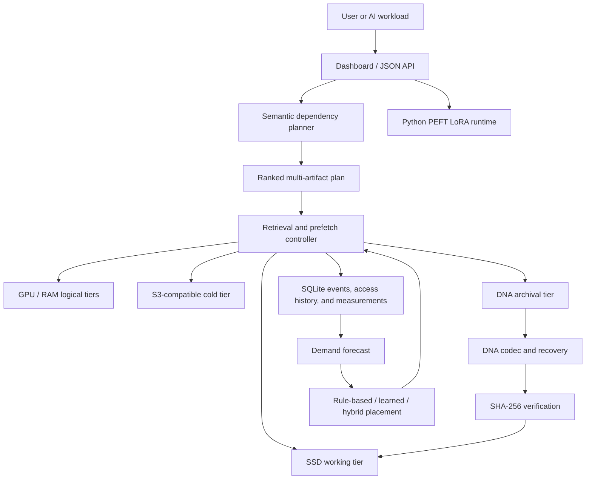
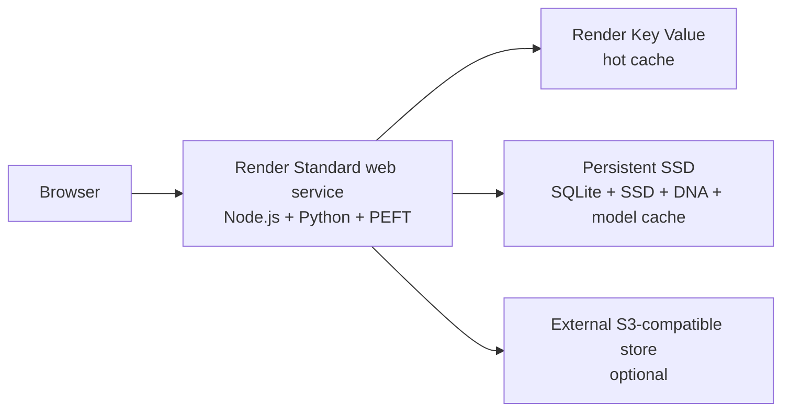

# HelixCache architecture and design rationale

## Executive summary

HelixCache is a research prototype for managing AI artifacts across a hierarchy
of fast, expensive storage and slow, inexpensive archival storage. It combines
a working binary-to-DNA codec with an intelligent control plane that predicts
future artifact use, starts cold retrieval early, records outcomes, and proposes
longer-term placement changes.

The central research question is not whether DNA can make inference faster. It
is whether an autonomous controller can make very cold storage practical for AI
artifacts by choosing what to archive and hiding part of restoration latency
through prediction and prefetching.

## High-level architecture



## Core request flow

1. A model, adapter, dataset, or file is registered with its metadata and
   SHA-256 checksum.
2. A natural-language workload request is embedded locally and compared with
   artifact IDs, filenames, MIME types, descriptions, and tags.
3. The planner returns a ranked dependency plan with confidence, order, and an
   action for each artifact.
4. Warm dependencies are used in place. S3 and DNA dependencies are prefetched
   to SSD before the workload needs them.
5. DNA retrieval decodes redundant strands, repairs recoverable damage,
   reconstructs missing shards, and verifies the original checksum.
6. Each access, move, cache lookup, prefetch, and inference operation writes
   telemetry to SQLite.
7. Recent access history is weighted more strongly to forecast demand.
8. Rule-based, learned, and hybrid policies translate current evidence into
   recommended storage tiers.

The resulting feedback loop is:

```text
predict → plan → prefetch → retrieve → verify → measure → forecast → place
```

## Storage hierarchy

| Logical tier | Role | Default implementation | Optional production-style backend |
|---|---|---|---|
| GPU | Immediate model availability | In-process memory | Render Key Value / Redis-compatible cache |
| RAM | Fast reusable artifacts | In-process memory | Render Key Value / Redis-compatible cache |
| SSD | Active working set | Local filesystem | Render persistent SSD disk |
| S3 | Economical cold objects | Filesystem fallback | Any SigV4-compatible object store |
| DNA | Long-term archive | FASTA-like `.dna` files | Physical synthesis and sequencing are out of scope |

GPU and RAM are logical placement tiers; the prototype does not allocate real
CUDA memory. This separation allows the controller and its policies to be tested
without specialized hardware.

## Why DNA archival storage?

DNA is relevant to the coldest part of an AI storage hierarchy because it has
the potential for extremely high density, long retention, and storage without
continuous power. Those properties are attractive for rarely accessed model
versions, evaluation datasets, compliance snapshots, and historical knowledge.

DNA also introduces difficult engineering constraints: synthesis and sequencing
are slow, reads can be damaged or missing, and physical access is expensive. The
prototype addresses the software side of that boundary with constrained
encoding, redundant reads, CRC-32 strand checks, Reed–Solomon parity, whole-file
SHA-256 verification, and predictive retrieval. It does not claim to implement
or benchmark physical molecular storage.

## DNA archive pipeline

```mermaid
flowchart LR
    File["Original bytes"] --> Compress["Gzip compression"]
    Compress --> Shards["Data + Reed–Solomon parity shards"]
    Shards --> Packets["Index, geometry, archive tag, CRC-32"]
    Packets --> Bases["Constrained A/C/G/T encoding"]
    Bases --> Copies["Redundant physical-read simulation"]
    Copies --> FASTA["FASTA-like DNA archive"]
    FASTA --> Repair["Read repair and shard reconstruction"]
    Repair --> Hash["SHA-256 verification"]
```



The nucleotide mapping targets balanced GC content and prevents adjacent
repeated bases. Recovery supports isolated substitutions, insertions, deletions,
and missing strands within the configured redundancy limits.

## Intelligent prediction design

### Why local embeddings?

Literal keyword overlap cannot connect requests such as “location lookup” with
an artifact named `maps-address-v2`. The local feature-hashing embedder combines
words, controlled semantic aliases, and character trigrams. This provides
deterministic semantic matching for a small registry without an external API,
network latency, usage cost, or disclosure of artifact metadata.

The trade-off is that this compact embedder is not equivalent to a large,
domain-trained embedding model. The planner interface isolates that choice so a
hosted embedding model or LLM planner can replace it later.

### Why multi-artifact plans and cancellation?

AI workloads commonly depend on more than one model or dataset. A ranked plan
makes dependencies explicit and allows cold transfers to begin in order of
confidence. A caller-provided job ID supports cancellation between transfers if
the workload changes, limiting unnecessary movement and prefetch waste.

### Why three placement policies?

No single policy is best before sufficient production history exists:

- **Rule-based** uses explainable frequency, recency, and business priority.
- **Learned** emphasizes demand inferred from access history.
- **Hybrid** combines both, retaining safe priors while adapting to new usage.

Side-by-side comparison makes the decision observable before placement changes
are applied.

## Persistence and observability

SQLite stores the artifact registry, controller events, access history, and
measurements in one local transactional database. This is appropriate for a
single-controller research prototype and works naturally with a persistent
Render disk. A multi-instance production controller would move this state to a
shared database.

Measured outputs include:

- Wall-clock operation latency
- Cache hits and cache-hit rate
- S3 transfer-cost estimates based on bytes moved
- Prefetched artifacts and whether they were later consumed
- Prefetch waste rate
- Artifact access history used by demand forecasting

## Inference runtime

The Node.js service launches a Python worker that loads a Transformers causal
language model and a genuine PEFT LoRA adapter. If `LORA_ADAPTER` is configured,
the worker loads that adapter. Otherwise it creates, serializes, reloads, and
runs a rank-4 LoRA adapter as a runtime integration test. The generated default
adapter is structurally real but randomly initialized, so it is not presented as
a trained task model.

## Render deployment topology



The Standard instance is selected because PyTorch and Transformers are not
reliable within the 512 MB Free/Starter limit. A persistent disk preserves
SQLite, uploads, DNA archives, and downloaded model files. The Key Value service
holds loss-tolerant hot-cache entries. S3 credentials remain dashboard-managed
secrets and the filesystem fallback keeps object storage optional.

## Validated outcomes

The automated suite currently contains 12 passing tests. Together they verify:

| Outcome | Evidence |
|---|---|
| Exact binary preservation | Arbitrary bytes round-trip through DNA and FASTA |
| Damage recovery | Independent substitutions and single insertion/deletion repair |
| Biologically constrained representation | GC balance remains within 45–55%; longest homopolymer is one |
| Missing-strand recovery | Reed–Solomon parity reconstructs removed data shards |
| Real-file integrity | A 4 KB binary survives archive, corruption, restore, and checksum verification |
| Semantic planning | Semantic aliases resolve a ranked multi-artifact plan |
| Predictive prefetch | Cold DNA/S3 dependencies move to SSD and verify successfully |
| Cancellation | An aborted job performs no remaining cold transfer |
| Adaptive demand | Recent access history raises forecast demand above its initial prior |
| Policy comparison | Rule-based, learned, and hybrid placements are returned together |
| Persistence | Registry, events, and measurements survive controller restart |
| Modeled latency benefit | Example cold retrieval improves from 4,300 ms to 3,100 ms, saving 1,200 ms |

The latency result is a transparent planning model, not measured physical DNA
performance. Runtime telemetry records real software operation times separately.

## Boundaries and future evolution

- Physical DNA synthesis and sequencing remain simulated.
- GPU/RAM names describe logical placement, not hardware allocation.
- The local embedding model is designed for a small demonstration registry.
- SQLite and a persistent disk imply a single active controller instance.
- The default generated LoRA adapter is not trained.
- Production evolution would use domain embeddings, a shared transactional
  metadata store, durable object storage, asynchronous transfer workers,
  capacity constraints, and measurements from a real molecular-storage service.

